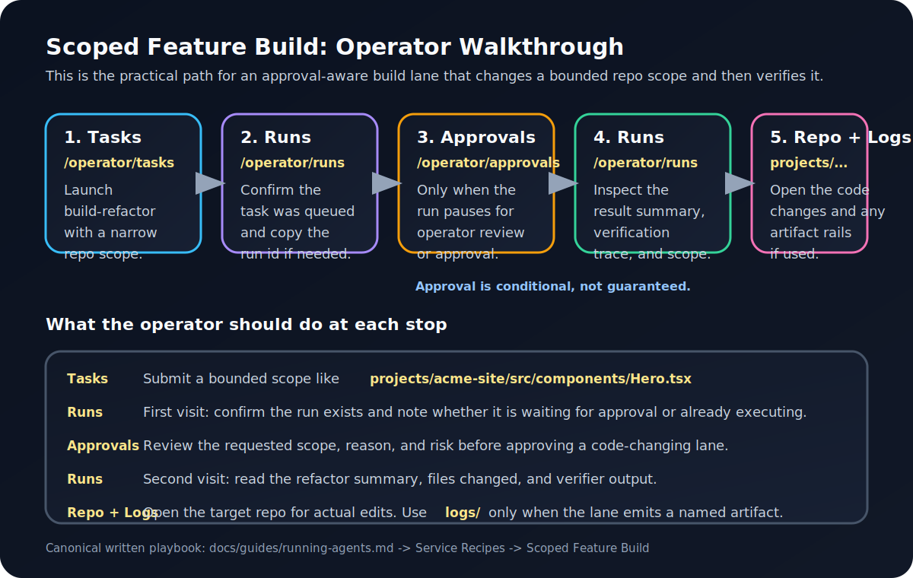

# Running Agents

## Overview

OpenClaw agents are not one execution mode anymore.

Use these terms separately:

- `spawned-worker capable`: the orchestrator can invoke the agent task lane by
  spawning `src/index.ts`
- `serviceAvailable`: the repo contains a long-running `src/service.ts`
  implementation
- `serviceExpected`: the current host/runtime contract expects that agent to be
  covered by a persistent systemd unit
- `serviceInstalled` / `serviceRunning`: host-proven unit truth, not manifest
  guesses

Current runtime truth:

- most agents are still **worker-first**
- only `doc-specialist` and `reddit-helper` are currently
  **service-expected**
- all declared runtime agents have `src/service.ts`, but that does not mean
  every one of them must be running as a persistent host service

The operator truth source for this distinction is:

```text
GET /api/agents/overview
GET /api/health/extended
```

## Where Agents Can Work

The current runtime assumes target repos live inside the workspace tree.

Recommended layout:

```text
workspace/
  projects/
    client-a/
    client-b/
```

Use task scopes relative to the workspace root, for example:

- `projects/client-a`
- `projects/client-a/src`
- `projects/client-a/app/page.tsx`

Do not assume agents can safely reach arbitrary repos elsewhere on disk. The
current permission model is intentionally bounded around `workspace`.

## Lifecycle Modes

### Worker-first

Worker-first agents are routed through orchestrator tasks. Their service
entrypoint may exist in-repo, but host service coverage is not currently a
runtime requirement.

Examples:

- `build-refactor-agent`
- `system-monitor-agent`
- `security-agent`
- `qa-verification-agent`
- the rest of the current task portfolio outside `doc-specialist` and
  `reddit-helper`

### Service-expected

These agents are expected to have persistent host coverage. Today that means:

- `doc-specialist`
- `reddit-helper`

For those lanes, a healthy runtime story includes:

- `serviceExpected=true`
- a real `serviceUnitName`
- host-visible `serviceInstalled` and `serviceRunning` truth
- incident/reporting coverage when the unit is missing or stopped

## Task-Driven Invocation

```javascript
// Representative worker-first invocation path
const result = spawn('tsx', [
  'src/index.ts',
  '--payload', payloadPath
], {
  cwd: agentDir,
  stdio: ['pipe', 'pipe', 'inherit']
});
```

The orchestrator:
1. Prepares a JSON payload in `/tmp`
2. Spawns the agent with `--payload /tmp/payload-123.json`
3. Collects stdout (JSON result)
4. Saves result and updates state

This remains the main execution path for most agents.

## Agent Configuration

Each agent keeps its runtime contract in:

```bash
cat agents/<agent-id>/agent.config.json
cat agents/<agent-id>/SOUL.md
```

Pay special attention to:

- `orchestratorStatePath`
- `serviceStatePath`
- allowed skills / model settings
- whether the agent is treated as service-expected by current orchestrator
  runtime policy

## What Each Agent Produces

Use this as the practical day-one map:

- `doc-specialist` / `drift-repair`
  Output: knowledge packs in `logs/knowledge-packs/` plus run evidence in
  `/operator/runs`
- `reddit-helper` / `reddit-response`
  Output: drafted replies in `logs/reddit-drafts.jsonl`, queue payloads in
  `logs/devvit-submissions.jsonl`, and run evidence in `/operator/runs`
- `content-agent` / `content-generate`
  Output: generated content in the task run result; check `/operator/runs`
  first because this lane does not usually create a named artifact file
- `data-extraction-agent` / `data-extraction`
  Output: extracted record/entity summaries, coverage, and tool evidence in
  `/operator/runs`
- `normalization-agent` / `normalize-data`
  Output: normalized result summary in `/operator/runs`
- `summarization-agent` / `summarize-content`
  Output: summary result in `/operator/runs`
- `market-research-agent` / `market-research`
  Output: findings, source-plan evidence, and fetch results in
  `/operator/runs`
- `qa-verification-agent` / `qa-verification`
  Output: verification trace, closure posture, and test/check evidence in
  `/operator/runs`, with related incident history when applicable
- `integration-agent` / `integration-workflow`
  Output: workflow graph, delegation evidence, and stop/closure reasoning in
  `/operator/runs`
- `build-refactor-agent` / `build-refactor`
  Output: real code changes in the scoped repo, plus verification and
  governance evidence in `/operator/runs`
- `security-agent` / `security-audit`
  Output: findings and remediation guidance in `/operator/runs`
- `skill-audit-agent` / `skill-audit`
  Output: governance/audit result in `/operator/runs`
- `system-monitor-agent` / `system-monitor`
  Output: runtime diagnosis in `/operator/runs`, with related pressure visible
  in `/operator/system-health` and `/operator/incidents`

Rule of thumb:

- `logs/*-service.json` is agent memory and service heartbeat
- `/operator/runs` is the main operator-facing output surface
- `logs/` matters most for lanes that explicitly write artifacts

## Service Recipes

The recipes below are the fastest way to use the system for real delivery work.
Launch them from `/operator/tasks` or through `POST /api/tasks/trigger`.

The JSON blocks below are representative task payloads.

### Client Audit

Use this when a client wants to know whether a site or app is ready for
production, risky, or in need of repair.

Task flow:

1. Run `security-audit` on the target repo scope.

```json
{
  "type": "security-audit",
  "payload": {
    "type": "scan",
    "scope": "projects/acme-site"
  }
}
```

2. Run `system-monitor` to capture current runtime posture.

```json
{
  "type": "system-monitor",
  "payload": {
    "type": "health"
  }
}
```

3. If you want a client-facing written report, run `content-generate`.

```json
{
  "type": "content-generate",
  "payload": {
    "type": "operator-notice",
    "source": {
      "name": "Acme Site Audit",
      "description": "Write a client-facing audit summary from the latest security-audit and system-monitor runs for projects/acme-site. Focus on launch risk, major findings, and next steps."
    },
    "style": "client-facing",
    "length": "medium"
  }
}
```

Expected output:

- security findings and remediation guidance in `/operator/runs`
- runtime diagnosis in `/operator/runs` and `/operator/system-health`
- optional client-facing report text in the `content-generate` run result
- no repo mutation unless you later choose to run a repair lane

### Scoped Feature Build

Use this when the client wants a bounded feature, redesign slice, or fix inside
one known area of the repo.

Task flow:

1. Run `build-refactor` with a narrow scope and clear intent.

```json
{
  "type": "build-refactor",
  "payload": {
    "type": "refactor",
    "scope": "projects/acme-site/src/components/Hero.tsx",
    "intent": "Add a clearer call-to-action and tighten mobile spacing without changing unrelated sections.",
    "constraints": {
      "maxFilesChanged": 3,
      "runTests": true
    }
  }
}
```

2. If the lane pauses, approve it in `/operator/approvals`.

3. Run `qa-verification` against the same repo or surface.

```json
{
  "type": "qa-verification",
  "payload": {
    "target": "projects/acme-site",
    "suite": "smoke",
    "mode": "execute"
  }
}
```

Expected output:

- real code edits in the scoped target repo
- refactor summary and governance evidence in `/operator/runs`
- approval record in `/operator/approvals` when the lane is gated
- verification trace in `/operator/runs`

Notes:

- narrower scopes produce better autonomous edits and clearer review posture
- if your repo already has a preferred verification command, surface it through
  your task payload or local verification policy before broad use

### Handoff Package

Use this when delivery is done and you need to leave behind a readable,
operator-friendly project package for the client or next developer.

Task flow:

1. Run `drift-repair` over the docs or handoff-relevant paths that changed.

```json
{
  "type": "drift-repair",
  "payload": {
    "requestedBy": "operator",
    "paths": [
      "projects/acme-site/README.md",
      "projects/acme-site/docs/deployment.md",
      "projects/acme-site/docs/ops.md"
    ],
    "notes": "Prepare post-delivery handoff knowledge pack for Acme site."
  }
}
```

2. Run `summarize-content` on your delivery notes, release notes, or copied run
summary.

```json
{
  "type": "summarize-content",
  "payload": {
    "sourceType": "report",
    "content": "<paste delivery notes, release notes, or run-summary text here>",
    "format": "executive_summary"
  }
}
```

3. Run `content-generate` for the final handoff narrative.

```json
{
  "type": "content-generate",
  "payload": {
    "type": "readme",
    "source": {
      "name": "Acme Site Handoff",
      "description": "Create a concise developer handoff covering what changed, where the repo lives, how to run it, how to verify it, and the next recommended tasks."
    },
    "style": "technical",
    "length": "medium"
  }
}
```

4. If the handoff is meant to support a release sign-off or repair closure, run
`qa-verification` as the final step.

Expected output:

- a durable knowledge pack in `logs/knowledge-packs/`
- a concise summary in `/operator/runs`
- handoff text in the `content-generate` run result
- optional release or closure proof in the `qa-verification` run result

Notes:

- `drift-repair` works best when the repo already contains real docs or notes
- if the project has no handoff docs yet, seed at least a README before you
  expect a strong knowledge-pack result

## Operator Walkthrough

If you prefer a visual path over a capability list, use the walkthrough below
for the `Scoped feature build` recipe.



### Scoped Feature Build: Tasks -> Runs -> Approvals -> Runs -> Repo/Logs

This is the practical operator path for a bounded code-change lane.

1. Open `/operator/tasks` and launch the `build-refactor` payload for a narrow
   project scope such as `projects/acme-site/src/components/Hero.tsx`.
2. Open `/operator/runs` immediately after launch and confirm the run exists.
   This is where you first see whether the task is queued, executing, or
   waiting for approval.
3. If the run is gated, open `/operator/approvals` and review the request. Use
   this stop to decide whether the scope, intent, and risk are acceptable.
4. Return to `/operator/runs` after approval to inspect the final outcome:
   files changed, confidence, verification summary, and any verifier-backed
   evidence.
5. Open the target repo under `workspace/projects/...` to inspect the real code
   edits. Only check `logs/` if the lane wrote a named artifact; for
   `build-refactor`, the main output is usually the repo itself plus the run
   record.

What to expect:

- `Tasks` is the launch surface
- `Runs` is the main output surface
- `Approvals` is conditional and only matters when the lane pauses for review
- the repo itself is the deliverable for code-edit lanes
- `logs/` is secondary unless the task explicitly writes artifacts

## Host Service Checks

```bash
curl -fsS -H "Authorization: Bearer $API_KEY" http://127.0.0.1:3312/api/agents/overview | jq '.agents[] | {id, serviceExpected, lifecycleMode, hostServiceStatus, serviceUnitName}'
curl -fsS -H "Authorization: Bearer $API_KEY" http://127.0.0.1:3312/api/health/extended | jq '.workers'
```

On Linux hosts, you can then confirm unit state directly:

```bash
systemctl show doc-specialist.service reddit-helper.service --property=Id,LoadState,ActiveState,SubState,UnitFileState --no-pager
```

If a service-expected agent is missing or stopped, the orchestrator should also
surface that as observed incident pressure.

## Manual Invocation

Manual invocation is still mainly a debugging path:

```bash
cd agents/doc-specialist
npm install
tsx src/index.ts --payload /path/to/payload.json > /path/to/result.json
```

## Debugging Agent Issues

If an agent fails:

1. **Check orchestrator log**:
   ```bash
   grep "agent spawn error" logs/orchestrator.log
   ```

2. **Check temp payloads** (if not cleaned up):
   ```bash
   ls -la /tmp/orchestrator-payload-*
   cat /tmp/orchestrator-payload-* | jq
   ```

3. **Run agent manually**:
   ```bash
   cd agents/doc-specialist
   tsx src/index.ts --payload test-payload.json
   ```

4. **Check agent logs** (if it writes them):
   ```bash
   cat logs/agents/{agent_name}.log
   ```

See [Task Types](../reference/task-types.md) for what triggers which agents.
